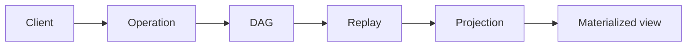

# Mental model

NodalMerge is a local-first distributed state engine. Within that, one more
specific idea does most of the work: NodalMerge is a deterministic history
system first, and a state system second.

If your team internalizes that one idea, most architecture decisions become easier.

## The one-line model

A room is an append-only history graph; current state is a projection you derive from that history.

## Room

A room is an isolated convergence domain.

A room is the boundary for:

- History replication
- Convergence guarantees
- Authority and capability enforcement
- Lifecycle controls (persistence, GC, eviction)

If two features should not share convergence or authority behavior, they should not share a room.

## Transaction

A transaction is an immutable operation bundle.

Transactions carry:

- Author identity
- Lamport timestamp
- Parent references
- Operations
- Optional signatures

Transactions are content-addressed and replayable, which is why they work as audit and synchronization primitives.

## Node

A node wraps a transaction and participates in the room DAG.

Nodes are the actual units peers exchange, verify, and replay.

Think in nodes when debugging convergence, not just “latest value per key.”

## DAG

Room history forms a directed acyclic graph.

The DAG model enables:

- Concurrent edits
- Replay
- Forking
- Branching
- Deterministic merge

## Convergence

Peers eventually resolve to identical state after receiving equivalent history.

Deterministic ordering and merge rules guarantee identical replay results for equivalent valid input sets.

This is why “same nodes, different order” should not produce different final outcomes.

## Speculative vs canonical view

In many deployments, you reason about two projections:

- **Speculative view**: includes local optimistic writes
- **Canonical view**: reflects accepted remote/authoritative outcomes

UI responsiveness usually depends on speculative reads; trust-sensitive outcomes depend on canonical reads.

## Speculative execution

Clients apply operations locally immediately.

This provides:

- Instant UI feedback
- Offline operation
- Reduced interaction latency under network variance

Speculative execution is not a separate history system. It is a temporary projection lane over the same deterministic model.

## Presence is not durable state

Presence is an ephemeral collaboration side channel.

Use it for:

- Cursor/viewport context
- Live participant signals
- Transient collaboration hints

Do not model durable business truth in presence messages.

## How teams get this wrong

Common mental-model mistakes:

- Treating rooms as mutable shared objects instead of history domains
- Treating snapshots as source of truth instead of derived state
- Mixing intent and canonical state without explicit boundaries
- Assuming transport order determines final state

## Fast decision checks

When designing a feature, ask:

1. Which room should own this convergence boundary?
2. Is this durable state or ephemeral collaboration signal?
3. Should this write be speculative, canonical, or both?
4. What replay evidence do we need for audit/debug confidence?

## Related pages

- [architecture/overview](/architecture/overview)
- [architecture/crdt-model](/architecture/crdt-model)
- [architecture/projections](/architecture/projections)
- [architecture/speculative-vs-authoritative](/architecture/speculative-vs-authoritative)
- [architecture/replay-and-branching](/architecture/replay-and-branching)