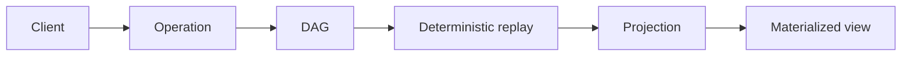

# Architecture overview

NodalMerge is a local-first distributed state engine. It replicates immutable
operations instead of mutable documents — every peer deterministically
replays the same history to materialize identical state, online or offline.

You do not reconcile mutable snapshots directly. You exchange and verify history, then materialize state from that shared history.

## What this page gives you

Use this page to get the high-level map before diving into specific architecture topics.

If you are implementing or operating NodalMerge, this page should answer:

- What data model is replicated
- How peers converge deterministically
- Where authority and policy fit
- How storage and blob flows work in production

## Mental model in one sentence

Each peer appends signed CRDT transactions to a room DAG, syncs missing history with other peers, and deterministically resolves that history into the same state projection.

## The architecture layers

### 1) Operation layer

The operation layer defines merge behavior for each data shape.

- Map operations for key/value state
- Text operations for collaborative text editing
- List operations for ordered collections

These operations are designed for deterministic replay under concurrent writers.

### 2) Transaction layer

Operations are grouped into immutable transactions.

Each transaction carries author and ordering metadata and is content-addressed so identity follows content, not transport.

### 3) Graph layer

Transactions are linked into a directed acyclic graph (DAG) per room.

This is the core replay surface. It supports:

- Deterministic merge and convergence
- Historical replay for debugging and audit
- Branch/fork workflows where needed

### 4) Projection layer

The DAG is not the state your product reads. A **projection** is a
deterministic function from history to a materialized view — a map, a
document, a query result, a canonical or speculative lane. The same history
always produces the same projection, which is what makes projections safe to
rebuild, cache, invalidate, and register per-query rather than hand-rolled
per feature.

This is one of the two primitives (alongside immutable operations) that
everything else in NodalMerge is built from — see
[architecture/projections](/architecture/projections) for the dedicated
walkthrough.

### 5) Sync layer

Peers exchange missing history, not full state snapshots.

NodalMerge supports incremental reconciliation strategies that reduce payload size and catch-up cost for large histories.

### 6) Storage and blob layer

Structured state and binary content have distinct lifecycles.

- Transaction history is persisted for deterministic reconstruction
- Blobs are content-addressed and managed with lifecycle/GC policy

### 7) Authority and policy layer

NodalMerge supports both optimistic local interaction and authoritative validation.

Common production pattern:

- Clients write speculative intent for immediate UX
- Authoritative systems validate and produce canonical outcomes

## Core design principles

- Reconcile history, not snapshots
- Keep conflict resolution deterministic
- Make replay a first-class operational tool
- Separate optimistic UX from canonical authority when needed

## How to read the architecture section

Read in this order:

1. `architecture/mental-model`
2. `architecture/crdt-model`
3. `architecture/projections`
4. `architecture/speculative-vs-authoritative`
5. `architecture/replay-and-branching`
6. `architecture/authority-and-topology`
7. `architecture/sync-protocol`
8. `architecture/storage-and-blobs`

## Practical implications

For engineering teams, this architecture gives you:

- Predictable multi-writer convergence behavior
- Better incident debugging through replayable history
- Clear separation between client responsiveness and server authority
- A path from local prototypes to production operator controls