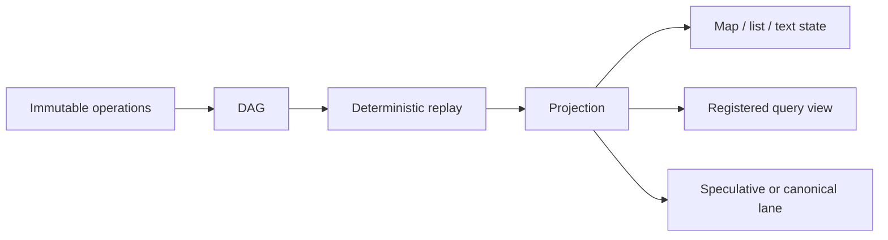

# Projections

Immutable operations are what NodalMerge **stores** — and what makes
NodalMerge NodalMerge. Projections are what that history becomes once you
turn it into something usable. They're not a second primitive sitting next
to operations; they're the most powerful *consequence* of having operations
as the source of truth in the first place. Without projections, NodalMerge
would still be NodalMerge, but every consumer would have to replay and
interpret the operation history itself. Without immutable operations,
projections have nothing to be a deterministic interpretation *of*.

```
Immutable operations
        ↓
Deterministic replay
        ↓
Projections
        ↓
Materializations
        ↓
Applications
```

A working definition, where every word is load-bearing:

> A projection is a **deterministic**, **materialized** **interpretation** of
> **immutable operation history**.

- **Deterministic** — every peer computes the same result from the same history.
- **Materialized** — it's actual usable state, not a query expression you evaluate later.
- **Interpretation** — the operation log doesn't prescribe one single "view"; the same history supports many.
- **Immutable operation history** — a projection is derived from the DAG. It is never the source of truth itself.

## The mechanism



## Two kinds of projections

**State projections** produce canonical state that lives back in the room's
data model — maps, lists, text, blob references, indexes. These are what
`resolve` / `resolve_canonical` / `resolve_list` return, and what the
speculative/canonical lanes are built from. They're still "state" by another
name.

**Materialization projections** produce something that lives *outside* the
state graph entirely — a deterministic function of history that outputs a
different kind of artifact altogether. The concrete shipped example today is
[NodalMerge Studio's repository virtualization](/studio/guides/repository-virtualization):
each work-unit branch gets a real, physically isolated working directory on
disk, derived deterministically from that branch's state. The same pattern
generalizes to other materializations — a search index, a generated build
output, an audit timeline export — without changing anything about the
underlying history. Those aren't shipped as built-in projection types today;
the point is that the mechanism doesn't care, because a materialization is
still just a deterministic function of the same immutable operations.

## Why this is a powerful consequence, not a special case

Most systems that separate "log" from "read model" treat the read model as
one specific integration — a search index, a cache, a materialized SQL view.
NodalMerge treats the *shape of that separation itself* as reusable, and
applies it everywhere:

- **Map, text, and list state** — `resolve` / `resolve_canonical` /
  `resolve_list` are projections over the room DAG, incrementally maintained
  so reads stay O(live keys) or O(items) instead of O(history). See
  [benchmarks/text-engine-performance](/benchmarks/text-engine-performance)
  for what that costs in practice.
- **Speculative vs. canonical lanes** — two projections of the same history,
  one including local optimistic writes and one reflecting only accepted
  outcomes. See
  [architecture/speculative-vs-authoritative](/architecture/speculative-vs-authoritative).
- **Registered query projections** — `query.register` defines a descriptor
  (a prefix, a shape) once; `projection.build` materializes it at a given
  checkpoint; `projection.read` pages through the result; `projection.invalidate`
  drops it when the query definition changes. See
  [api-reference/websocket-commands](/api-reference/websocket-commands#query-and-projection-commands)
  for the full command contract.
- **Replay to a point in time** — a projection isn't pinned to "now." The
  same function run against a bounded prefix of history produces the state
  *as of* that checkpoint, which is what makes deterministic replay,
  audit, and debugging possible without a separate snapshot mechanism. See
  [architecture/replay-and-branching](/architecture/replay-and-branching).

One mechanism — deterministic replay of immutable operations into a
materialized view — covers all four. Nothing here is a special case, and
none of it would exist without operations as the single source of truth
underneath it.

## What makes a projection safe to treat this way

A projection is a pure function of the history it was built from:

- **Deterministic**: the same operations, in the same causal order, always
  produce the same materialized view — this is inherited directly from the
  same merge determinism that makes peer convergence work at all (see
  [architecture/crdt-model](/architecture/crdt-model)).
- **Rebuildable**: because it's derived, not authoritative, a projection can
  be thrown away and recomputed from history at any time. There is no
  migration step where a projection's internal representation and the
  source of truth can drift permanently out of sync — worst case, you
  rebuild it.
- **Checkpoint-addressable**: projections are built against an explicit
  checkpoint (`"latest"`, a sequence number, a content hash), not implicitly
  against "whatever the DAG looks like right now." That's what makes two
  peers' projections comparable and what makes replay-to-a-point-in-time
  well-defined.
- **Invalidatable, not just updatable**: when a query's own definition
  changes (not just its input data), the projection built from the old
  definition is retired explicitly via `projection.invalidate` rather than
  silently drifting.

## What this buys you as a developer

Without a shared projection model, "read model" tends to mean N different
bespoke mechanisms — one for your UI's live state, one for search, one for
an audit export, one for offline caching — each with its own invalidation
bugs. With projections as the standard consequence of replaying operations,
all of those are the same operation (replay history into a view) with
different descriptors and checkpoints, which means:

- Debugging a divergent read is always the same question: *which history,
  replayed through which projection, at which checkpoint?*
- Adding a new read shape is registering a query descriptor, not building a
  new subsystem.
- Caching is safe by construction — a stale or corrupted projection is
  never a source-of-truth problem, only a rebuild.

## Terminology note

"Projection" is overloaded — CQRS, event sourcing, and plain databases each
use it slightly differently. The first few times it helps to say
**deterministic projection** or **programmable materialized view** in full;
once the concept is anchored, "projection" alone is fine.
[NodalMerge Studio](/studio/concepts/overview) builds on this concept but
uses "projection" to refer to a compressed, agent-oriented view of
work-unit state, rather than a materialized interpretation of the operation
DAG.

## Related pages

- [architecture/overview](/architecture/overview)
- [architecture/crdt-model](/architecture/crdt-model)
- [architecture/speculative-vs-authoritative](/architecture/speculative-vs-authoritative)
- [architecture/replay-and-branching](/architecture/replay-and-branching)
- [api-reference/websocket-commands](/api-reference/websocket-commands#query-and-projection-commands)
- [benchmarks/text-engine-performance](/benchmarks/text-engine-performance)
- [studio/guides/repository-virtualization](/studio/guides/repository-virtualization) — a shipped materialization projection
- [studio/concepts/overview](/studio/concepts/overview) — Studio's distinct, agent-context use of "projection"
