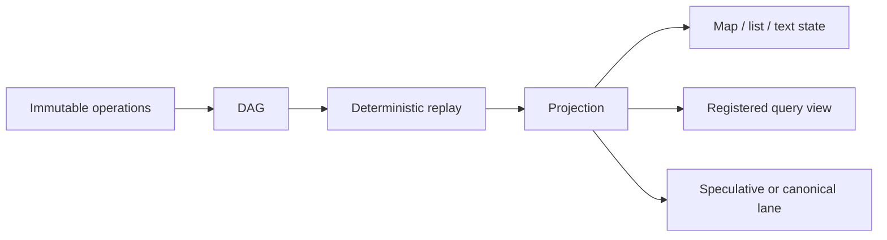

# Projections

Immutable operations are what NodalMerge **stores**. Projections are what
your product **reads**. Between the two sits one deterministic function: same
history in, same materialized view out, every time, on every peer.

If operations are the primitive that makes convergence possible, projections
are the primitive that makes convergence *usable* — they're the other half
of the same idea, not a feature bolted onto it.

## Why this is a primitive, not a feature

Most systems that separate "log" from "read model" treat the read model as
one specific integration — a search index, a cache, a materialized SQL view.
NodalMerge treats the *shape of that separation itself* as the core
abstraction, and reuses it everywhere:

- **Map, text, and list state** — `resolve` / `resolve_canonical` /
  `resolve_list` are projections over the room DAG, incrementally maintained
  so reads stay O(live keys) or O(items) instead of O(history). See
  [benchmarks/text-engine-performance](/benchmarks/text-engine-performance)
  for what that costs in practice.
- **Speculative vs. canonical lanes** — two projections of the same history,
  one including local optimistic writes and one reflecting only accepted
  outcomes. See
  [architecture/speculative-vs-authoritative](/architecture/speculative-vs-authoritative).
- **Registered query projections** — `query.register` defines a descriptor
  (a prefix, a shape) once; `projection.build` materializes it at a given
  checkpoint; `projection.read` pages through the result; `projection.invalidate`
  drops it when the query definition changes. See
  [api-reference/websocket-commands](/api-reference/websocket-commands#query-and-projection-commands)
  for the full command contract.
- **Replay to a point in time** — a projection isn't pinned to "now." The
  same function run against a bounded prefix of history produces the state
  *as of* that checkpoint, which is what makes deterministic replay,
  audit, and debugging possible without a separate snapshot mechanism. See
  [architecture/replay-and-branching](/architecture/replay-and-branching).

One mechanism — deterministic replay of immutable operations into a
materialized view — covers all four. Nothing here is a special case.

## What makes a projection safe to treat this way

A projection is a pure function of the history it was built from:

- **Deterministic**: the same operations, in the same causal order, always
  produce the same materialized view — this is inherited directly from the
  same merge determinism that makes peer convergence work at all (see
  [architecture/crdt-model](/architecture/crdt-model)).
- **Rebuildable**: because it's derived, not authoritative, a projection can
  be thrown away and recomputed from history at any time. There is no
  migration step where a projection's internal representation and the
  source of truth can drift permanently out of sync — worst case, you
  rebuild it.
- **Checkpoint-addressable**: projections are built against an explicit
  checkpoint (`"latest"`, a sequence number, a content hash), not implicitly
  against "whatever the DAG looks like right now." That's what makes two
  peers' projections comparable and what makes replay-to-a-point-in-time
  well-defined.
- **Invalidatable, not just updatable**: when a query's own definition
  changes (not just its input data), the projection built from the old
  definition is retired explicitly via `projection.invalidate` rather than
  silently drifting.

## What this buys you as a developer

Without a shared projection model, "read model" tends to mean N different
bespoke mechanisms — one for your UI's live state, one for search, one for
an audit export, one for offline caching — each with its own invalidation
bugs. With projections as the primitive, all of those are the same
operation (replay history into a view) with different descriptors and
checkpoints, which means:

- Debugging a divergent read is always the same question: *which history,
  replayed through which projection, at which checkpoint?*
- Adding a new read shape is registering a query descriptor, not building a
  new subsystem.
- Caching is safe by construction — a stale or corrupted projection is
  never a source-of-truth problem, only a rebuild.

## Related pages

- [architecture/overview](/architecture/overview)
- [architecture/crdt-model](/architecture/crdt-model)
- [architecture/speculative-vs-authoritative](/architecture/speculative-vs-authoritative)
- [architecture/replay-and-branching](/architecture/replay-and-branching)
- [api-reference/websocket-commands](/api-reference/websocket-commands#query-and-projection-commands)
- [benchmarks/text-engine-performance](/benchmarks/text-engine-performance)
