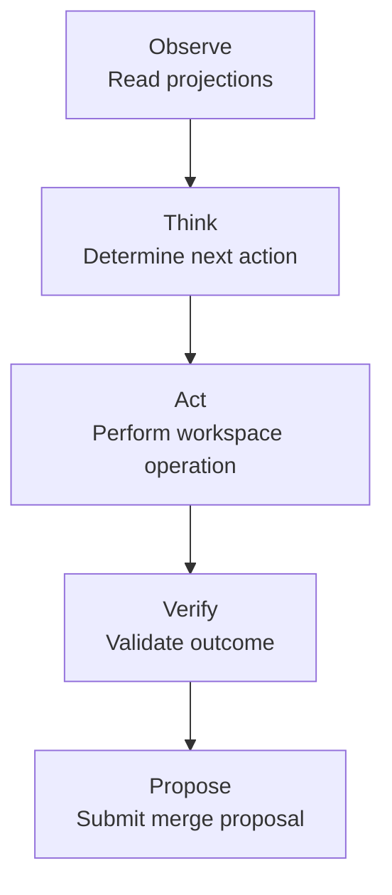

# How Studio works

## Key concepts

| Concept | Description |
|---|---|
| **Work Unit** | The primary execution abstraction: `Goal + Branch`. Every agent session is scoped to exactly one work unit. |
| **Projection** | Agent-consumable derived views of the DAG. Agents never consume raw history — they request projections at configurable compression levels (Full / Normal / Compact / Emergency). |
| **Branch** | Isolated workspace for speculative work. Changes are made on branches, not directly on authoritative state. |
| **Merge Proposal** | Structured intent to reconcile branch changes into the authoritative branch. Includes diff, artifact lineage, execution event, and verification results. |
| **Known Good State** | A verified branch checkpoint used for rollback and recovery. |
| **Room** | Sync boundary for multi-peer NodalMerge replication. |
| **Review Policy** | Per-work-unit setting (`Human Required` / `Agent Approval` / `Hybrid`) controlling who approves a proposal before it applies. |
| **Candidate Branch** | Optional safety layer: when promotion branches are enabled, applies land here instead of `main` until a human explicitly promotes. |
| **Candidate Conflict** / **Task Conflict** | Two proposals landing on the candidate branch (or two sibling work units under the same goal) touching the same file paths. Resolved by reconciling, restarting the losing goal, or resolving manually — see [Trust & autonomy → Reconciling candidate conflicts](/studio/concepts/trust-and-autonomy#reconciling-candidate-conflicts). |
| **Experiment** | A parent work unit fanned out into 2+ sibling forks (different model, architecture, library, or product framing) that run in parallel for comparison. |
| **Steering** | Pausing a running work unit and injecting a constraint, which forks a sibling that resumes with it — the original's decision log is never rewritten. |
| **Counterfactual** | A sibling work unit branched from a completed proposal's base state and re-run under a different model/profile for comparison. |

## The agent execution loop

The loop ends at proposal submission. Merge authority remains external — agents
propose, by default humans approve.

## Inspectability

Because every plan, task, proposal, and decision is a persistent DAG node, Studio can
answer questions ephemeral agent frameworks cannot:

- What did the agent produce? Why? From what input state?
- Which model produced this proposal? Under what constraints?
- What was the full artifact lineage for this change?

## Token efficiency through state compression

Agents receive compact projections — not full DAG history. Projections compress
relevant state (active work units, tasks, proposals, artifact chain) into a
token-efficient view. Knowledge artifacts (constraints, conventions, decisions)
persist across runs so agents don't rediscover the same information on every
execution.

## Architectural invariant

All persistent state lives in NodalMerge nodes. There is no separate memory
database, no vector database, and no agent-specific memory store.

## Next

- [Architecture](/studio/concepts/architecture) — the three-layer design and how Studio
  relates to the NodalMerge core engine
- [Trust & autonomy](/studio/concepts/trust-and-autonomy) — review policy, promotion
  branches, and experiments
