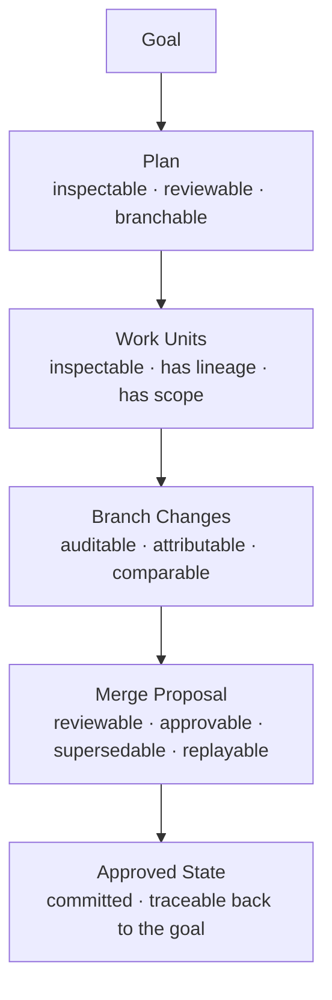

# NodalMerge Studio

NodalMerge Studio is a persistent collaborative runtime where humans and AI agents share
goals, reasoning, execution, and artifacts as one content-addressed graph, built on the
[NodalMerge](/) engine. Humans, AI agents, automation, and MCP tools work together through
deterministic projections, coordinated task execution, and human review workflows.

Every step anyone takes — a goal, a decision, a tool call, an agent's chat turn, a merge —
becomes a durable node in that graph. Every node can be inspected, branched, replayed,
merged, materialized to a working tree, and audited. The durable graph is the product;
agents are features of it. Repositories are just one projection of it.

## The artifact pipeline

1. **You define a goal.** A human describes what needs to be accomplished.
2. **An orchestrator agent plans it.** The orchestrator breaks the goal into work units and tasks.
3. **Worker agents execute tasks.** Each worker operates on its own branch, producing changes.
4. **Merge proposals are generated.** Workers submit structured proposals with full lineage.
5. **A proposal is reviewed and approved.** By default a human approves it — a goal can opt into agent or hybrid review instead. See [Trust & autonomy](/studio/concepts/trust-and-autonomy).
6. **State converges.** Approved changes land in the authoritative branch.

## Why teams use Studio

<CardGroup cols={2}>
  <Card title="One shared graph" icon="diagram-project">
    Every plan, task, proposal, decision, and agent chat turn is a persistent,
    content-addressed node — shared memory for humans and agents alike. Trace any
    approved change back through its entire lineage to the original goal.
  </Card>
  <Card title="Human-governed by default" icon="user-check">
    Agents propose; humans decide. The merge review workflow enforces human approval
    before speculative work lands in the authoritative branch — unless a goal
    explicitly opts out.
  </Card>
  <Card title="Pathways: review, branch, materialize" icon="code-branch">
    Scrub the whole graph in the Pathways tab. Review the reasoning behind any step,
    branch from any node to spawn an alternate execution, replay a proposal under a
    different model, or materialize any node's state back onto disk as a working tree.
  </Card>
  <Card title="MCP-native" icon="plug">
    A frozen MCP v1 tool surface with 117 tools across 21 namespaces. Integrate any
    MCP-compatible client with the Studio host.
  </Card>
</CardGroup>

## Get started

<CardGroup cols={2}>
  <Card title="Install the extension" icon="puzzle-piece" href="https://marketplace.visualstudio.com/items?itemName=nodalmerge-studio.nodalmerge-studio">
    Get NodalMerge Studio from the VS Code Marketplace — the extension bundles the
    Studio host, no separate install required. Needs VS Code 1.90+ and the .NET SDK 10.0.
  </Card>
  <Card title="Quickstart" icon="rocket" href="/studio/quickstart">
    Configure an agent profile and run your first goal in the Control Tower.
  </Card>
  <Card title="How Studio works" icon="brain" href="/studio/concepts/overview">
    The three-layer architecture and how Studio relates to the NodalMerge core engine.
  </Card>
  <Card title="Source on GitHub" icon="github" href="https://github.com/bgstratt/nodalmerge-studio">
    Browse the `nodalmerge-studio` repo, or see [Build from source](/studio/guides/build-from-source)
    if you want to run it from a local checkout.
  </Card>
</CardGroup>

**New here? Start with the [Quickstart](/studio/quickstart) →**
